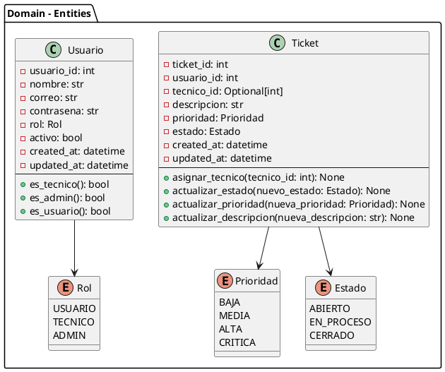
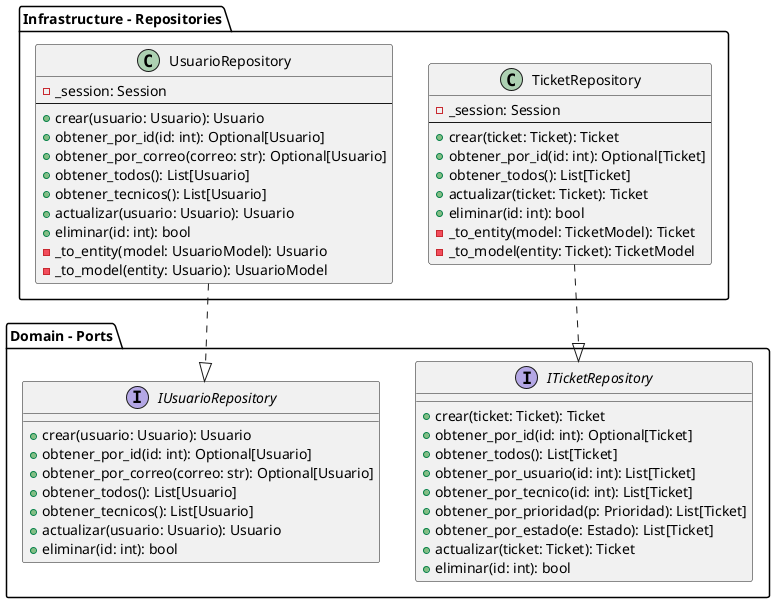
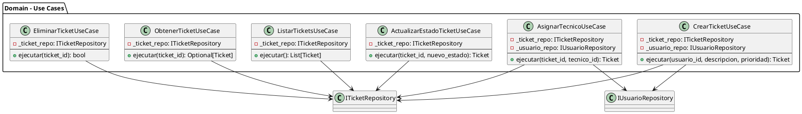

# Diagramas UML - HelpDeskPro

## Sistema de Gestión de Incidencias

---

## 1. Diagrama de Componentes

```
┌─────────────────────────────────────────────────────────────────┐
│                        API LAYER                                │
│                    (Adaptador de Entrada)                       │
│                                                                 │
│  ┌────────────────────┐      ┌────────────────────┐          │
│  │   routes.py         │      │ usuario_routes.py │          │
│  │  - crear_ticket     │      │  - crear_usuario   │          │
│  │  - listar_tickets   │      │  - listar_usuarios │          │
│  │  - asignar_tecnico  │      │  - actualizar      │          │
│  └──────────┬──────────┘      └──────────┬─────────┘          │
│             │                           │                    │
│             └───────────┬─────────────────┘                    │
│                        ▼                                      │
│              ┌────────────────────┐                           │
│              │  dependencies.py   │                           │
│              │  - get_ticket_repo  │                           │
│              │  - get_usuario_repo │                           │
│              └──────────┬─────────┘                           │
└─────────────────────────┼─────────────────────────────────────┘
                          │ uses
                          ▼
┌─────────────────────────────────────────────────────────────────┐
│                       DOMAIN LAYER                              │
│                    (Núcleo de Negocio)                         │
│                                                                 │
│  ┌────────────────────┐      ┌────────────────────┐          │
│  │   Use Cases        │      │     Entities        │          │
│  │                    │      │                     │          │
│  │ CrearTicketUseCase │      │      Ticket         │          │
│  │ AsignarTecnicoUC   │      │      Usuario         │          │
│  │ ActualizarEstadoUC │      │                     │          │
│  │ ListarTicketsUC    │      │                     │          │
│  └──────────┬─────────┘      └──────────┬─────────┘          │
│             │                           │                    │
│             │ uses                       │                    │
│             │                           │                    │
│             └───────────┬────────────────┘                    │
│                        ▼                                      │
│              ┌────────────────────┐                           │
│              │      Ports         │                           │
│              │  (Interfaces)       │                           │
│              │                    │                           │
│              │ ITicketRepository  │                           │
│              │ IUsuarioRepository │                           │
│              └──────────┬─────────┘                           │
└─────────────────────────┼─────────────────────────────────────┘
                          │ implements
                          ▼
┌─────────────────────────────────────────────────────────────────┐
│                  INFRASTRUCTURE LAYER                            │
│                    (Adaptadores)                                │
│                                                                 │
│  ┌────────────────────┐      ┌────────────────────┐          │
│  │   Repositories     │      │     Database       │          │
│  │                    │      │                     │          │
│  │ TicketRepository   │      │   TicketModel       │          │
│  │ UsuarioRepository  │      │   UsuarioModel      │          │
│  │                    │      │   SQLAlchemy        │          │
│  └──────────┬─────────┘      └──────────┬─────────┘          │
│             │                           │                    │
│             └───────────┬───────────────┘                    │
│                        ▼                                      │
│              ┌────────────────────┐                           │
│              │      MySQL         │                           │
│              │   helpdeskpro     │                           │
│              └───────────────────┘                           │
└───────────────────────────────────────────────────────────────┘
```

---

## 2. Diagrama de Clases - Entidades de Dominio



**Representación Textual:**

```
┌─────────────────────────────────────┐
│            Ticket                   │
├─────────────────────────────────────┤
│ - ticket_id: int                    │
│ - usuario_id: int                   │
│ - tecnico_id: Optional[int]          │
│ - descripcion: str                  │
│ - prioridad: Prioridad              │
│ - estado: Estado                    │
│ - created_at: datetime              │
│ - updated_at: datetime              │
├─────────────────────────────────────┤
│ + asignar_tecnico(tecnico_id)       │
│ + actualizar_estado(estado)         │
│ + actualizar_prioridad(prioridad)   │
│ + actualizar_descripcion(desc)      │
└─────────────────────────────────────┘
              │
              │ uses
              ▼
┌─────────────────────────────────────┐
│          Prioridad (Enum)           │
├─────────────────────────────────────┤
│ BAJA                                 │
│ MEDIA                                │
│ ALTA                                 │
│ CRITICA                              │
└─────────────────────────────────────┘

┌─────────────────────────────────────┐
│          Estado (Enum)               │
├─────────────────────────────────────┤
│ ABIERTO                              │
│ EN_PROCESO                           │
│ CERRADO                              │
└─────────────────────────────────────┘

┌─────────────────────────────────────┐
│            Usuario                   │
├─────────────────────────────────────┤
│ - usuario_id: int                    │
│ - nombre: str                         │
│ - correo: str                         │
│ - contrasena: str                     │
│ - rol: Rol                            │
│ - activo: bool                        │
│ - created_at: datetime                │
│ - updated_at: datetime                │
├─────────────────────────────────────┤
│ + es_tecnico(): bool                 │
│ + es_admin(): bool                   │
│ + es_usuario(): bool                 │
└─────────────────────────────────────┘
              │
              │ uses
              ▼
┌─────────────────────────────────────┐
│           Rol (Enum)                │
├─────────────────────────────────────┤
│ USUARIO                              │
│ TECNICO                              │
│ ADMIN                                │
└─────────────────────────────────────┘
```

---

## 3. Diagrama de Clases - Repositorios



**Representación Textual:**

```
┌─────────────────────────────────────────────┐
│      ITicketRepository <<interface>>       │
├─────────────────────────────────────────────┤
│ + crear(ticket): Ticket                    │
│ + obtener_por_id(id): Optional[Ticket]     │
│ + obtener_todos(): List[Ticket]            │
│ + obtener_por_usuario(id): List[Ticket]     │
│ + obtener_por_tecnico(id): List[Ticket]    │
│ + obtener_por_prioridad(p): List[Ticket]    │
│ + obtener_por_estado(e): List[Ticket]      │
│ + actualizar(ticket): Ticket               │
│ + eliminar(id): bool                       │
└─────────────────────────────────────────────┘
                    ▲
                    │ implements
                    │
┌─────────────────────────────────────────────┐
│        TicketRepository                      │
├─────────────────────────────────────────────┤
│ - _session: Session                          │
├─────────────────────────────────────────────┤
│ + crear(ticket): Ticket                     │
│ + obtener_por_id(id): Optional[Ticket]      │
│ + obtener_todos(): List[Ticket]            │
│ + actualizar(ticket): Ticket                │
│ + eliminar(id): bool                        │
│ - _to_entity(model): Ticket                 │
│ - _to_model(entity): TicketModel            │
└─────────────────────────────────────────────┘

┌─────────────────────────────────────────────┐
│     IUsuarioRepository <<interface>>        │
├─────────────────────────────────────────────┤
│ + crear(usuario): Usuario                   │
│ + obtener_por_id(id): Optional[Usuario]     │
│ + obtener_por_correo(correo): Optional[Usuario]│
│ + obtener_todos(): List[Usuario]            │
│ + obtener_tecnicos(): List[Usuario]        │
│ + actualizar(usuario): Usuario              │
│ + eliminar(id): bool                       │
└─────────────────────────────────────────────┘
                    ▲
                    │ implements
                    │
┌─────────────────────────────────────────────┐
│        UsuarioRepository                    │
├─────────────────────────────────────────────┤
│ - _session: Session                          │
├─────────────────────────────────────────────┤
│ + crear(usuario): Usuario                   │
│ + obtener_por_id(id): Optional[Usuario]     │
│ + obtener_por_correo(correo): Optional[Usuario]│
│ + obtener_todos(): List[Usuario]            │
│ + obtener_tecnicos(): List[Usuario]        │
│ + actualizar(usuario): Usuario              │
│ + eliminar(id): bool                        │
│ - _to_entity(model): Usuario                │
│ - _to_model(entity): UsuarioModel           │
└─────────────────────────────────────────────┘
```

---

## 4. Diagrama de Clases - Casos de Uso



**Representación Textual:**

```
┌──────────────────────────────────────┐
│     CrearTicketUseCase               │
├──────────────────────────────────────┤
│ - _ticket_repo: ITicketRepository    │
│ - _usuario_repo: IUsuarioRepository  │
├──────────────────────────────────────┤
│ + ejecutar(usuario_id, descripcion,  │
│           prioridad): Ticket          │
└──────────────────────────────────────┘
         │                    │
         │ uses               │ uses
         ▼                    ▼
┌─────────────────┐  ┌─────────────────┐
│ ITicketRepository│  │IUsuarioRepository│
└─────────────────┘  └─────────────────┘

┌──────────────────────────────────────┐
│   AsignarTecnicoUseCase             │
├──────────────────────────────────────┤
│ - _ticket_repo: ITicketRepository    │
│ - _usuario_repo: IUsuarioRepository  │
├──────────────────────────────────────┤
│ + ejecutar(ticket_id, tecnico_id):  │
│           Ticket                     │
└──────────────────────────────────────┘

┌──────────────────────────────────────┐
│ ActualizarEstadoTicketUseCase        │
├──────────────────────────────────────┤
│ - _ticket_repo: ITicketRepository    │
├──────────────────────────────────────┤
│ + ejecutar(ticket_id, estado):      │
│           Ticket                     │
└──────────────────────────────────────┘
```

---

## 5. Diagrama de Secuencia - Crear Ticket

```
┌─────────┐  ┌─────────┐  ┌──────────┐  ┌──────────┐  ┌──────────┐  ┌─────────┐
│ Cliente │  │   API  │  │Use Case │  │TicketRepo│  │UsuarioRepo│ │Database │
└────┬────┘  └────┬───┘  └────┬────┘  └────┬─────┘  └────┬─────┘  └────┬────┘
     │            │            │            │              │             │
     │ POST       │            │            │              │             │
     │ /tickets/  │            │            │              │             │
     ├───────────>│            │            │              │             │
     │            │            │            │              │             │
     │            │ Dependency │            │              │             │
     │            │ Injection  │            │              │             │
     │            ├───────────>│            │              │             │
     │            │            │            │              │             │
     │            │ ejecutar(  │            │              │             │
     │            │ usuario_id, │            │              │             │
     │            │ descripcion)│            │              │             │
     │            ├───────────>│            │              │             │
     │            │            │            │              │             │
     │            │            │ obtener_   │              │             │
     │            │            │ por_id()   │              │             │
     │            │            ├───────────>│              │             │
     │            │            │            │ SELECT       │             │
     │            │            │            ├──────────────>│             │
     │            │            │            │              │             │
     │            │            │            │              │ SELECT      │
     │            │            │            │              ├─────────────>│
     │            │            │            │              │<─────────────│
     │            │            │            │<─────────────│             │
     │            │            │<───────────│              │             │
     │            │            │ Usuario    │              │             │
     │            │            │            │              │             │
     │            │            │ Validar    │              │             │
     │            │            │ usuario    │              │             │
     │            │            │            │              │             │
     │            │            │ crear()    │              │             │
     │            │            ├───────────>│              │             │
     │            │            │            │ _to_model()  │             │
     │            │            │            │ INSERT       │             │
     │            │            │            ├──────────────>│             │
     │            │            │            │              │             │
     │            │            │            │<─────────────│             │
     │            │            │<───────────│ TicketModel  │             │
     │            │            │ Ticket     │              │             │
     │            │<───────────│            │              │             │
     │            │ Ticket     │            │              │             │
     │<───────────│            │            │              │             │
     │ Response   │            │            │              │             │
```

---

## 6. Diagrama de Secuencia - Asignar Técnico

```
┌─────────┐  ┌─────────┐  ┌──────────┐  ┌──────────┐  ┌──────────┐  ┌─────────┐
│ Cliente │  │   API  │  │Use Case │  │TicketRepo│  │UsuarioRepo│ │Database │
└────┬────┘  └────┬───┘  └────┬────┘  └────┬─────┘  └────┬─────┘  └────┬────┘
     │            │            │            │              │             │
     │ POST       │            │            │              │             │
     │ /asignar-  │            │            │              │             │
     │ tecnico    │            │            │              │             │
     ├───────────>│            │            │              │             │
     │            │ ejecutar(  │            │              │             │
     │            │ ticket_id, │            │              │             │
     │            │ tecnico_id)│            │              │             │
     │            ├───────────>│            │              │             │
     │            │            │            │              │             │
     │            │            │ obtener_   │              │             │
     │            │            │ por_id()   │              │             │
     │            │            │ (ticket)   │              │             │
     │            │            ├───────────>│              │             │
     │            │            │            │ SELECT       │             │
     │            │            │            ├──────────────>│             │
     │            │            │            │<─────────────│             │
     │            │            │<───────────│ Ticket       │             │
     │            │            │ Ticket     │              │             │
     │            │            │            │              │             │
     │            │            │ obtener_   │              │             │
     │            │            │ por_id()   │              │             │
     │            │            │ (tecnico)  │              │             │
     │            │            │            │              │ SELECT      │
     │            │            │            │              ├─────────────>│
     │            │            │            │              │<─────────────│
     │            │            │<───────────│              │ Usuario      │
     │            │            │ Usuario    │              │             │
     │            │            │            │              │             │
     │            │            │ Validar    │              │             │
     │            │            │ (es técnico)              │             │
     │            │            │            │              │             │
     │            │            │ asignar_   │              │             │
     │            │            │ tecnico() │              │             │
     │            │            │ (en Ticket)               │             │
     │            │            │            │              │             │
     │            │            │ actualizar │              │             │
     │            │            │ ()         │              │             │
     │            │            ├───────────>│              │             │
     │            │            │            │ UPDATE       │             │
     │            │            │            ├──────────────>│             │
     │            │            │            │<─────────────│             │
     │            │            │<───────────│ Ticket       │             │
     │            │<───────────│            │              │             │
     │            │ Ticket     │            │              │             │
     │<───────────│            │            │              │             │
     │ Response   │            │            │              │             │
```

---

## 7. Diagrama de Paquetes

```
┌─────────────────────────────────────────────────────────┐
│                    HelpDeskPro                           │
│                                                          │
│  ┌──────────────────────────────────────────────────┐  │
│  │              api/                                 │  │
│  │  ┌──────────────┐  ┌──────────────┐            │  │
│  │  │ routes.py    │  │ usuario_routes│            │  │
│  │  │ schemas.py   │  │ dependencies  │            │  │
│  │  └──────────────┘  └──────────────┘            │  │
│  └──────────────────────────────────────────────────┘  │
│                        │                                │
│                        │ depends on                     │
│                        ▼                                │
│  ┌──────────────────────────────────────────────────┐  │
│  │            domain/                                 │  │
│  │  ┌──────────────┐  ┌──────────────┐            │  │
│  │  │ entities/     │  │ ports/        │            │  │
│  │  │  - Ticket     │  │  - ITicketRepo│            │  │
│  │  │  - Usuario    │  │  - IUsuarioRepo│           │  │
│  │  └──────────────┘  └──────────────┘            │  │
│  │  ┌──────────────┐                                │  │
│  │  │ use_cases/   │                                │  │
│  │  │  - CrearTicket│                                │  │
│  │  │  - AsignarTecnico│                             │  │
│  │  └──────────────┘                                │  │
│  └──────────────────────────────────────────────────┘  │
│                        ▲                                │
│                        │ implements                     │
│                        │                                │
│  ┌──────────────────────────────────────────────────┐  │
│  │        infrastructure/                            │  │
│  │  ┌──────────────┐  ┌──────────────┐            │  │
│  │  │ repositories/│  │ database/     │            │  │
│  │  │  - TicketRepo│  │  - models.py  │            │  │
│  │  │  - UsuarioRepo│ │  - config.py  │            │  │
│  │  └──────────────┘  └──────────────┘            │  │
│  └──────────────────────────────────────────────────┘  │
└─────────────────────────────────────────────────────────┘
```

---

## 8. Diagrama de Actividad - Crear Ticket

```
                    [Inicio]
                       │
                       ▼
              ┌─────────────────┐
              │ Recibir Request │
              │ POST /tickets/  │
              └────────┬────────┘
                       │
                       ▼
              ┌─────────────────┐
              │ Validar Schema  │
              │ (Pydantic)       │
              └────────┬────────┘
                       │
                       ▼
              ┌─────────────────┐
              │ Inyectar        │
              │ Repositorios    │
              └────────┬────────┘
                       │
                       ▼
              ┌─────────────────┐
              │ CrearTicketUC   │
              │ .ejecutar()     │
              └────────┬────────┘
                       │
                       ▼
              ┌─────────────────┐
              │ Validar Usuario │
              │ existe?         │
              └────────┬────────┘
                       │
              ┌────────┴────────┐
              │                 │
            NO │                 │ SÍ
              │                 │
              ▼                 ▼
    ┌─────────────┐    ┌─────────────┐
    │   Error     │    │ Usuario      │
    │             │    │ activo?      │
    └─────────────┘    └──────┬───────┘
                               │
                      ┌────────┴────────┐
                      │                 │
                    NO │                 │ SÍ
                      │                 │
                      ▼                 ▼
            ┌─────────────┐    ┌─────────────┐
            │   Error     │    │ Validar      │
            │             │    │ Descripción │
            └─────────────┘    └──────┬───────┘
                                       │
                              ┌────────┴────────┐
                              │                 │
                            NO │                 │ SÍ
                              │                 │
                              ▼                 ▼
                    ┌─────────────┐    ┌─────────────┐
                    │   Error     │    │ Crear       │
                    │             │    │ Ticket      │
                    └─────────────┘    └──────┬──────┘
                                               │
                                               ▼
                                    ┌─────────────┐
                                    │ Guardar en  │
                                    │ BD          │
                                    └──────┬──────┘
                                           │
                                           ▼
                                    ┌─────────────┐
                                    │ Return      │
                                    │ Ticket      │
                                    └──────┬──────┘
                                           │
                                           ▼
                                    [Fin]
```

---

## 9. Diagrama de Estados - Ticket

```
┌─────────────┐
│   ABIERTO   │
│             │
│ tecnico_id  │
│ = None      │
└──────┬──────┘
       │
       │ asignar_tecnico()
       │
       ▼
┌─────────────────┐
│  EN_PROCESO      │
│                  │
│ tecnico_id       │
│ != None          │
└──────┬───────────┘
       │
       │ actualizar_estado(CERRADO)
       │
       ▼
┌─────────────┐
│   CERRADO    │
│              │
│ (No se puede │
│  modificar)  │
└─────────────┘

Transiciones:
- ABIERTO → EN_PROCESO: Al asignar técnico
- EN_PROCESO → CERRADO: Al cerrar ticket
- ❌ ABIERTO → CERRADO: NO permitido
- ❌ CERRADO → cualquier estado: NO permitido
```

---

## 10. Resumen de Arquitectura

### Separación de Responsabilidades

| Capa | Responsabilidad | Dependencias |
|------|----------------|--------------|
| **API** | Endpoints HTTP, Validación de entrada | Domain (Ports) |
| **Domain** | Lógica de negocio, Reglas de negocio | Ninguna |
| **Infrastructure** | Persistencia, Acceso a datos | Domain (Ports) |

### Flujo de Dependencias

```
API → Domain ← Infrastructure
```

- **API** depende de **Domain** (usa interfaces)
- **Infrastructure** depende de **Domain** (implementa interfaces)
- **Domain** NO depende de nadie (capa independiente)

### Principios Aplicados

1. ✅ **Dependency Inversion**: Depender de abstracciones (Ports)
2. ✅ **Single Responsibility**: Cada clase tiene una responsabilidad
3. ✅ **Open/Closed**: Abierto a extensión, cerrado a modificación
4. ✅ **Interface Segregation**: Interfaces específicas y pequeñas
5. ✅ **Separation of Concerns**: Separación clara de responsabilidades

---

## 11. Conclusión

Los diagramas UML muestran que el sistema cumple con:

✅ **Arquitectura Hexagonal**: Separación clara entre dominio e infraestructura  
✅ **Dependency Injection**: Implementado en todas las capas  
✅ **CRUD Completo**: Todas las operaciones documentadas  
✅ **Lógica Desacoplada**: Casos de uso independientes de BD  
✅ **Validaciones**: Implementadas en múltiples niveles

El diseño permite fácil mantenimiento, testing y escalabilidad futura.

